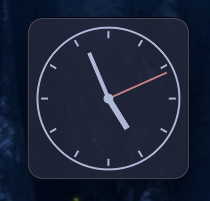
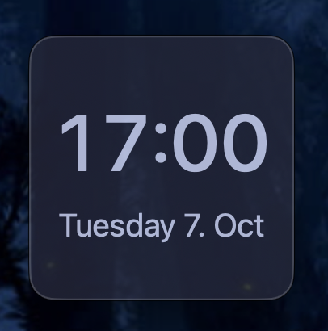

# yclock

A simple analog clock application for macOS, inspired by
[xclock](https://www.x.org/releases/X11R7.6/doc/man/man1/xclock.1.xhtml)
from X11 that you're used to on Linux and the BSDs.

## Features

- Analog and digital clock modes (toggle with ⌘D)
- Optional seconds display (toggle with ⌘S)
- Real-time updates every second
- Clean, minimal interface with no window chrome
- Draggable anywhere on the clock face
- Translucent window
- Themeable via configuration file

## Screenshots




## Configuration

`yclock` can be themed by creating a configuration file. The app looks
for config files in the following order:
1. `~/.yclock.conf`
2. `~/.config/yclock/yclock.conf`
3. `$XDG_CONFIG_HOME/yclock/yclock.conf`

See `conf/yclock.conf` for the format. The default theme is Catppuccin
Macchiato.

Example configuration:
```perl
# Colors in RGB hex format
background = #24273a
foreground = #cad3f5
second_hand = #ed8796
```

## Requirements

- macOS 10.15 or later
- Xcode Command Line Tools (for swiftc compiler)

## Building

Build the application:
```bash
$ make clean && make build
```

## Running

Run the application:
```bash
$ make run
```

## Installing

Install the application to /Applications:
```bash
$ make install
```

## License

This project is licensed under the Apache License 2.0 - see the
[LICENSE](LICENSE) file for details.
